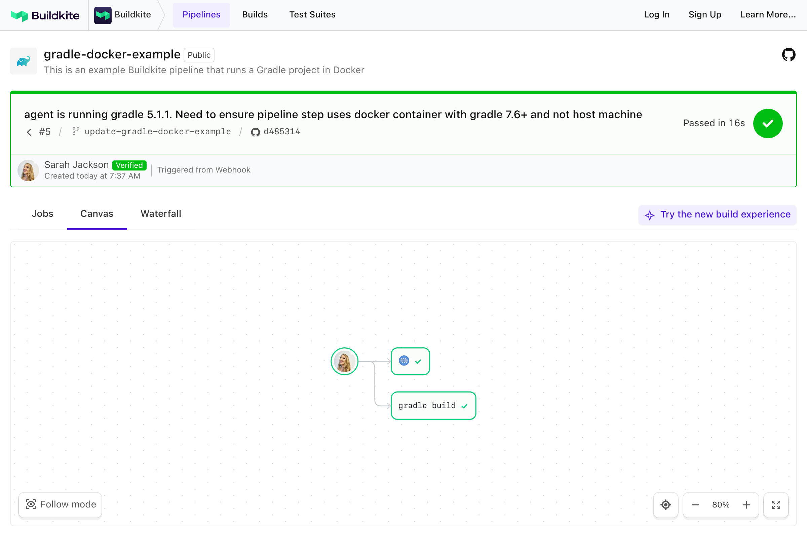

# Gradle Buildkite docker-compose example

This repository is an example [Buildkite](https://buildkite.com/) pipeline for building and testing a multi-project Java application using [Gradle](https://gradle.org/) and the [Docker Compose Buildkite Plugin](https://github.com/buildkite-plugins/docker-compose-buildkite-plugin).

👉 **See this example in action:** [buildkite.com/buildkite/gradle-docker-example](https://buildkite.com/buildkite/gradle-docker-example/builds/latest?branch=main)

See the full [Getting Started Guide](https://buildkite.com/docs/guides/getting-started) for step-by-step instructions on how to get this running, or try it yourself:

<!-- docs:start -->

## How it works

This example:
- Uses Gradle to build and test a multi-project Java application
- Runs inside the official [Gradle Docker image](https://hub.docker.com/_/gradle) via Docker Compose
- Uploads build artifacts to Buildkite
- Works with Gradle 7.6+
- Plays nicely with the [Elastic CI Stack for AWS](https://github.com/buildkite/elastic-ci-stack-for-aws)

The Java project comes from [Gradle's db-example-large-multi-project](https://github.com/gradle/db-example-large-multi-project).

## Requirements

- A [Buildkite agent](https://buildkite.com/docs/agent)
- No manual setup required — Gradle, Java, Docker, and Docker Compose are handled in the example pipeline

<!-- docs:end -->

## License

See [LICENSE.md](LICENSE.md) (MIT)
